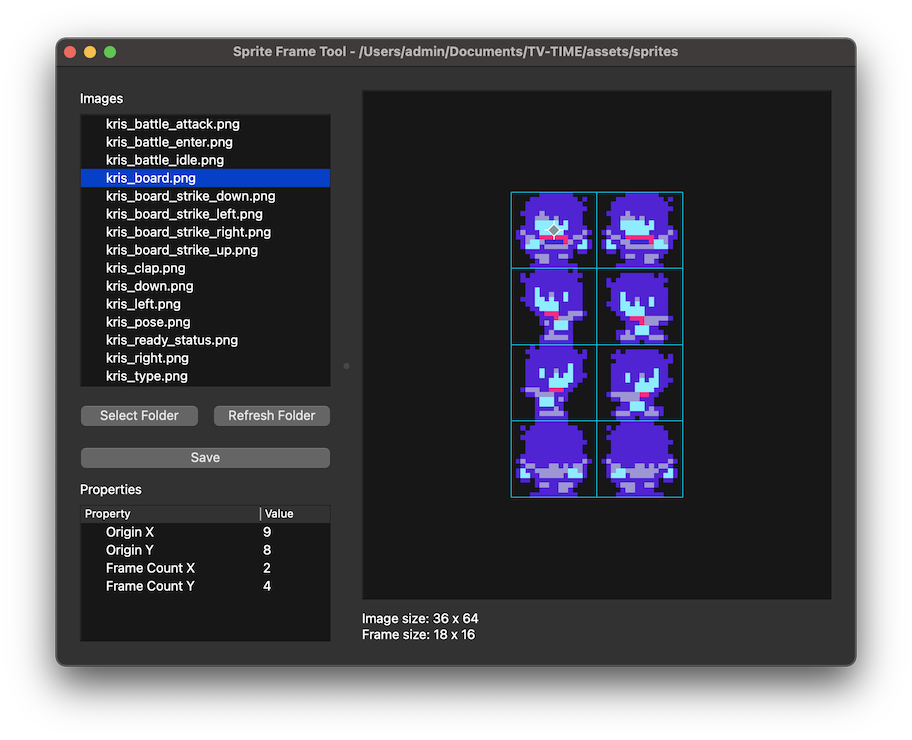

I needed a way to specify the amount of frames for sprites in game projects. So I made a way to specify the amonut of frames for sprites in game projects.

This project uses Python and Qt (through PySide6), so just set up a virtual environment (platform specific for activating it [(see here)](https://docs.python.org/3/tutorial/venv.html), but you can make the environment with `python -m venv venv`) and use `pip install -r requirements.txt` then you can run it with `python main.py`.

